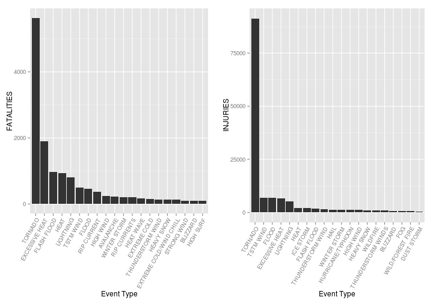

Analysis of Storm in the United States
======================================


# Introduction

Storms and other severe weather events can cause both public health and economic problems for communities and municipalities. Many severe events can result in fatalities, injuries, and property damage, and preventing such outcomes to the extent possible is a key concern.

This project involves exploring the U.S. National Oceanic and Atmospheric Administration's (NOAA) storm database. This database tracks characteristics of major storms and weather events in the United States, including when and where they occur, as well as estimates of any fatalities, injuries, and property damage.

# Data Processing
First let's load the data which and take a look at its structure summary


```r
storm <- read.csv("repdata-data-StormData.csv", sep = ",")
str(storm)
```

```
## 'data.frame':	902297 obs. of  37 variables:
##  $ STATE__   : num  1 1 1 1 1 1 1 1 1 1 ...
##  $ BGN_DATE  : Factor w/ 16335 levels "10/10/1954 0:00:00",..: 6523 6523 4213 11116 1426 1426 1462 2873 3980 3980 ...
##  $ BGN_TIME  : Factor w/ 3608 levels "000","0000","00:00:00 AM",..: 212 257 2645 1563 2524 3126 122 1563 3126 3126 ...
##  $ TIME_ZONE : Factor w/ 22 levels "ADT","AKS","AST",..: 7 7 7 7 7 7 7 7 7 7 ...
##  $ COUNTY    : num  97 3 57 89 43 77 9 123 125 57 ...
##  $ COUNTYNAME: Factor w/ 29601 levels "","5NM E OF MACKINAC BRIDGE TO PRESQUE ISLE LT MI",..: 13513 1873 4598 10592 4372 10094 1973 23873 24418 4598 ...
##  $ STATE     : Factor w/ 72 levels "AK","AL","AM",..: 2 2 2 2 2 2 2 2 2 2 ...
##  $ EVTYPE    : Factor w/ 985 levels "?","ABNORMALLY DRY",..: 830 830 830 830 830 830 830 830 830 830 ...
##  $ BGN_RANGE : num  0 0 0 0 0 0 0 0 0 0 ...
##  $ BGN_AZI   : Factor w/ 35 levels "","E","Eas","EE",..: 1 1 1 1 1 1 1 1 1 1 ...
##  $ BGN_LOCATI: Factor w/ 54429 levels "","?","(01R)AFB GNRY RNG AL",..: 1 1 1 1 1 1 1 1 1 1 ...
##  $ END_DATE  : Factor w/ 6663 levels "","10/10/1993 0:00:00",..: 1 1 1 1 1 1 1 1 1 1 ...
##  $ END_TIME  : Factor w/ 3647 levels "","?","0000",..: 1 1 1 1 1 1 1 1 1 1 ...
##  $ COUNTY_END: num  0 0 0 0 0 0 0 0 0 0 ...
##  $ COUNTYENDN: logi  NA NA NA NA NA NA ...
##  $ END_RANGE : num  0 0 0 0 0 0 0 0 0 0 ...
##  $ END_AZI   : Factor w/ 24 levels "","E","ENE","ESE",..: 1 1 1 1 1 1 1 1 1 1 ...
##  $ END_LOCATI: Factor w/ 34506 levels "","(0E4)PAYSON ARPT",..: 1 1 1 1 1 1 1 1 1 1 ...
##  $ LENGTH    : num  14 2 0.1 0 0 1.5 1.5 0 3.3 2.3 ...
##  $ WIDTH     : num  100 150 123 100 150 177 33 33 100 100 ...
##  $ F         : int  3 2 2 2 2 2 2 1 3 3 ...
##  $ MAG       : num  0 0 0 0 0 0 0 0 0 0 ...
##  $ FATALITIES: num  0 0 0 0 0 0 0 0 1 0 ...
##  $ INJURIES  : num  15 0 2 2 2 6 1 0 14 0 ...
##  $ PROPDMG   : num  25 2.5 25 2.5 2.5 2.5 2.5 2.5 25 25 ...
##  $ PROPDMGEXP: Factor w/ 19 levels "","-","?","+",..: 17 17 17 17 17 17 17 17 17 17 ...
##  $ CROPDMG   : num  0 0 0 0 0 0 0 0 0 0 ...
##  $ CROPDMGEXP: Factor w/ 9 levels "","?","0","2",..: 1 1 1 1 1 1 1 1 1 1 ...
##  $ WFO       : Factor w/ 542 levels "","2","43","9V9",..: 1 1 1 1 1 1 1 1 1 1 ...
##  $ STATEOFFIC: Factor w/ 250 levels "","ALABAMA, Central",..: 1 1 1 1 1 1 1 1 1 1 ...
##  $ ZONENAMES : Factor w/ 25112 levels "","                                                                                                                               "| __truncated__,..: 1 1 1 1 1 1 1 1 1 1 ...
##  $ LATITUDE  : num  3040 3042 3340 3458 3412 ...
##  $ LONGITUDE : num  8812 8755 8742 8626 8642 ...
##  $ LATITUDE_E: num  3051 0 0 0 0 ...
##  $ LONGITUDE_: num  8806 0 0 0 0 ...
##  $ REMARKS   : Factor w/ 436781 levels ""," ","  ","   ",..: 1 1 1 1 1 1 1 1 1 1 ...
##  $ REFNUM    : num  1 2 3 4 5 6 7 8 9 10 ...
```

The events in the database start in the year 1950 and end in November 2011. In the earlier years of the database there are generally fewer events recorded, most likely due to a lack of good records. More recent years should be considered more complete.

We will first load the libraries needed for this study

```r
library(plyr)
library(ggplot2)
library(gridExtra)
```

```
## Loading required package: grid
```


## Population Health
To study which type of storm is most harmful to the population health, we can take a look at the number of fatalities and injuries caused by different types of storm.

As we have in total **902297** obsevations, we can first arrange the data and only take the **20** first most serious types of stors. The data processing is as following


```r
fatalities <- aggregate(x = storm$FATALITIES, by = list(storm$EVTYPE), FUN = sum)
names(fatalities) <- c("EVTYPE", "FATALITIES")
fatalities <- arrange(fatalities, FATALITIES, decreasing = TRUE)
fatalities <- head(fatalities, n = 20)
fatalities <- within(fatalities, EVTYPE <- factor(x = EVTYPE, levels = fatalities$EVTYPE))

injuries <- aggregate(x = storm$INJURIES, by = list(storm$EVTYPE), FUN = sum)
names(injuries) <- c("EVTYPE", "INJURIES")
injuries <- arrange(injuries, INJURIES, decreasing = TRUE)
injuries <- head(injuries, n = 20)
injuries <- within(injuries, EVTYPE <- factor(x = EVTYPE, levels = injuries$EVTYPE))
```


## Economic Consequences

# Results
With the data we obtained about concerning the *population health*, now we can take a look at the two lists

```r
fatalities
```

```
##                     EVTYPE FATALITIES
## 1                  TORNADO       5633
## 2           EXCESSIVE HEAT       1903
## 3              FLASH FLOOD        978
## 4                     HEAT        937
## 5                LIGHTNING        816
## 6                TSTM WIND        504
## 7                    FLOOD        470
## 8              RIP CURRENT        368
## 9                HIGH WIND        248
## 10               AVALANCHE        224
## 11            WINTER STORM        206
## 12            RIP CURRENTS        204
## 13               HEAT WAVE        172
## 14            EXTREME COLD        160
## 15       THUNDERSTORM WIND        133
## 16              HEAVY SNOW        127
## 17 EXTREME COLD/WIND CHILL        125
## 18             STRONG WIND        103
## 19                BLIZZARD        101
## 20               HIGH SURF        101
```

```r
injuries
```

```
##                EVTYPE INJURIES
## 1             TORNADO    91346
## 2           TSTM WIND     6957
## 3               FLOOD     6789
## 4      EXCESSIVE HEAT     6525
## 5           LIGHTNING     5230
## 6                HEAT     2100
## 7           ICE STORM     1975
## 8         FLASH FLOOD     1777
## 9   THUNDERSTORM WIND     1488
## 10               HAIL     1361
## 11       WINTER STORM     1321
## 12  HURRICANE/TYPHOON     1275
## 13          HIGH WIND     1137
## 14         HEAVY SNOW     1021
## 15           WILDFIRE      911
## 16 THUNDERSTORM WINDS      908
## 17           BLIZZARD      805
## 18                FOG      734
## 19   WILD/FOREST FIRE      545
## 20         DUST STORM      440
```


```r
plot1 <- qplot(EVTYPE, data = fatalities, weight = FATALITIES, geom = "bar", 
    binwidth = 1) + scale_y_continuous("FATALITIES") + theme(axis.text.x = element_text(angle = 60, 
    hjust = 1)) + xlab("Event Type")

plot2 <- qplot(EVTYPE, data = injuries, weight = INJURIES, geom = "bar", binwidth = 1) + 
    scale_y_continuous("INJURIES") + theme(axis.text.x = element_text(angle = 60, 
    hjust = 1)) + xlab("Event Type")
grid.arrange(plot1, plot2, ncol = 2)
```

 

According to the histograms above, we note that the **tornado** is the most harmful for the population health as it causes the largest number of fatalities and injuries. In addition, as we note that **Excessive heat**, **Flash Flood**, **Heat** and **Lightning** also cause much larger number of fatality and injury than the other types of storm, we should also pay attention to these events.
