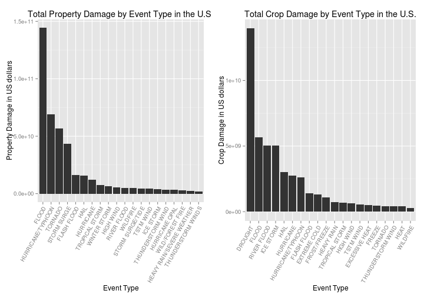

Impact of Different Weather Events on Population Health and Economy in the U.S.
===============================================================================

## Synopsis
In this report, we will analyze the impact of different weather events on *population health* and its *economic consequences* with the data collected from 1950 till 2011 in the U.S. National Oceanic and Atmospheric Administration's (NOAA) storm database. To decide which type of event is most harmful to the population health, we will use the estimates of fatalities and injuries, as the histogram shows in the end, **tornado** causes the largest number of fatalities and injuries. For the impact on economy, the estimates of property damage will be used, and the results show that **tornado** also has the greatest economic consequences.

## Introduction

Storms and other severe weather events can cause both public health and economic problems for communities and municipalities. Many severe events can result in fatalities, injuries, and property damage, and preventing such outcomes to the extent possible is a key concern.

This project involves exploring the U.S. National Oceanic and Atmospheric Administration's (NOAA) storm database. This database tracks characteristics of major storms and weather events in the United States, including when and where they occur, as well as estimates of any fatalities, injuries, and property damage.

## Data Processing
The full dataset of this study can be downloaded at the address https://d396qusza40orc.cloudfront.net/repdata%2Fdata%2FStormData.csv.bz2 . First let's load the data and take a look at its structure summary


```r
# download.file('http://d396qusza40orc.cloudfront.net/repdata/data/StormData.csv.bz2',
# 'StormData.csv.bz2')
storm <- read.csv(bzfile("StormData.csv.bz2"), sep = ",")
str(storm)
```

```
## 'data.frame':	236608 obs. of  37 variables:
##  $ STATE__   : num  1 1 1 1 1 1 1 1 1 1 ...
##  $ BGN_DATE  : Factor w/ 10527 levels "10/10/1954 0:00:00",..: 3499 3499 2106 6812 808 808 828 1483 1985 1985 ...
##  $ BGN_TIME  : int  130 145 1600 900 1500 2000 100 900 2000 2000 ...
##  $ TIME_ZONE : Factor w/ 18 levels "ADT","AST","CDT",..: 6 6 6 6 6 6 6 6 6 6 ...
##  $ COUNTY    : num  97 3 57 89 43 77 9 123 125 57 ...
##  $ COUNTYNAME: Factor w/ 4178 levels "","ABBEVILLE",..: 2317 207 1047 1885 872 1791 294 3901 3986 1047 ...
##  $ STATE     : Factor w/ 53 levels "AK","AL","AR",..: 2 2 2 2 2 2 2 2 2 2 ...
##  $ EVTYPE    : Factor w/ 537 levels "AGRICULTURAL FREEZE",..: 463 463 463 463 463 463 463 463 463 463 ...
##  $ BGN_RANGE : num  0 0 0 0 0 0 0 0 0 0 ...
##  $ BGN_AZI   : Factor w/ 34 levels "","E","Eas","EE",..: 1 1 1 1 1 1 1 1 1 1 ...
##  $ BGN_LOCATI: Factor w/ 13419 levels "","?","020","063>066",..: 1 1 1 1 1 1 1 1 1 1 ...
##  $ END_DATE  : Factor w/ 817 levels "","10/10/1993 0:00:00",..: 1 1 1 1 1 1 1 1 1 1 ...
##  $ END_TIME  : Factor w/ 1336 levels "","?","0000",..: 1 1 1 1 1 1 1 1 1 1 ...
##  $ COUNTY_END: num  0 0 0 0 0 0 0 0 0 0 ...
##  $ COUNTYENDN: logi  NA NA NA NA NA NA ...
##  $ END_RANGE : num  0 0 0 0 0 0 0 0 0 0 ...
##  $ END_AZI   : Factor w/ 22 levels "","E","ENE","ESE",..: 1 1 1 1 1 1 1 1 1 1 ...
##  $ END_LOCATI: Factor w/ 1873 levels "","- 11 ESE Jay",..: 1 1 1 1 1 1 1 1 1 1 ...
##  $ LENGTH    : num  14 2 0.1 0 0 1.5 1.5 0 3.3 2.3 ...
##  $ WIDTH     : num  100 150 123 100 150 177 33 33 100 100 ...
##  $ F         : int  3 2 2 2 2 2 2 1 3 3 ...
##  $ MAG       : num  0 0 0 0 0 0 0 0 0 0 ...
##  $ FATALITIES: num  0 0 0 0 0 0 0 0 1 0 ...
##  $ INJURIES  : num  15 0 2 2 2 6 1 0 14 0 ...
##  $ PROPDMG   : num  25 2.5 25 2.5 2.5 2.5 2.5 2.5 25 25 ...
##  $ PROPDMGEXP: Factor w/ 19 levels "","-","?","+",..: 17 17 17 17 17 17 17 17 17 17 ...
##  $ CROPDMG   : num  0 0 0 0 0 0 0 0 0 0 ...
##  $ CROPDMGEXP: Factor w/ 9 levels "","?","0","2",..: 1 1 1 1 1 1 1 1 1 1 ...
##  $ WFO       : Factor w/ 467 levels "","2","43","9V9",..: 1 1 1 1 1 1 1 1 1 1 ...
##  $ STATEOFFIC: logi  NA NA NA NA NA NA ...
##  $ ZONENAMES : Factor w/ 1898 levels "","ADAMS - ADAMS - BROWN - PIKE",..: 1 1 1 1 1 1 1 1 1 1 ...
##  $ LATITUDE  : num  3040 3042 3340 3458 3412 ...
##  $ LONGITUDE : num  8812 8755 8742 8626 8642 ...
##  $ LATITUDE_E: num  3051 0 0 0 0 ...
##  $ LONGITUDE_: num  8806 0 0 0 0 ...
##  $ REMARKS   : Factor w/ 23297 levels "","  ","   ",..: 1 1 1 1 1 1 1 1 1 1 ...
##  $ REFNUM    : num  1 2 3 4 5 6 7 8 9 10 ...
```

The events in the database start in the year 1950 and end in November 2011. In the earlier years of the database there are generally fewer events recorded, most likely due to a lack of good records. More recent years should be considered more complete.

We will first load the libraries needed for this study

```r
library(plyr)
library(ggplot2)
library(gridExtra)
```

```
## Loading required package: grid
```


### Population Health
To study which type of storm is most harmful to the population health, we can take a look at the number of fatalities and injuries caused by different types of storm.

As we have in total **236608** obsevations, we will **sort** the data first then only take the **20** first most serious types of weather events to visualize and analyze. The data processing is as following


```r
fatalities <- aggregate(x = storm$FATALITIES, by = list(storm$EVTYPE), FUN = sum)
names(fatalities) <- c("EVTYPE", "FATALITIES")
fatalities <- arrange(fatalities, FATALITIES, decreasing = TRUE)
fatalities <- head(fatalities, n = 20)
fatalities <- within(fatalities, EVTYPE <- factor(x = EVTYPE, levels = fatalities$EVTYPE))

injuries <- aggregate(x = storm$INJURIES, by = list(storm$EVTYPE), FUN = sum)
names(injuries) <- c("EVTYPE", "INJURIES")
injuries <- arrange(injuries, INJURIES, decreasing = TRUE)
injuries <- head(injuries, n = 20)
injuries <- within(injuries, EVTYPE <- factor(x = EVTYPE, levels = injuries$EVTYPE))
```


### Economic Consequences

We will use the **property damage** and **crop damage** to estimate the impact of different types of weather events on economy. The selection strategy is the same as the previous section. As explained in the section 2.7 of [Storm Data Documentation](https://d396qusza40orc.cloudfront.net/repdata%2Fpeer2_doc%2Fpd01016005curr.pdf), we will need to restore the data from the orginal data file with the information in `PROPDMGEXP` and `CROPDMGEXP`
* K or k for thousands 
* M or m for millions
* B or b for billions


```r
valid <- c("", "K", "k", "M", "m", "B", "b")
# If the -EXP is not in the valid set, set the corresponding value to zero
storm$PROPDMG[!is.element(storm$PROPDMGEXP, valid)] <- 0
storm$CROPDMG[!is.element(storm$CROPDMGEXP, valid)] <- 0

for (i in 1:3) {
    coef <- 10^(i * 3)
    storm$PROPDMG[is.element(storm$PROPDMGEXP, valid[i * 2:(i * 2 + 1)])] <- storm$PROPDMG[is.element(storm$PROPDMGEXP, 
        valid[i * 2:(i * 2 + 1)])] * coef
    storm$CROPDMG[is.element(storm$CROPDMGEXP, valid[i * 2:(i * 2 + 1)])] <- storm$CROPDMG[is.element(storm$CROPDMGEXP, 
        valid[i * 2:(i * 2 + 1)])] * coef
}

```


```r
property <- aggregate(x = storm$PROPDMG, by = list(storm$EVTYPE), FUN = sum)
names(property) <- c("EVTYPE", "PROPDMG")
property <- arrange(property, PROPDMG, decreasing = TRUE)
property <- head(property, n = 20)
property <- within(property, EVTYPE <- factor(x = EVTYPE, levels = property$EVTYPE))

crop <- aggregate(x = storm$CROPDMG, by = list(storm$EVTYPE), FUN = sum)
names(crop) <- c("EVTYPE", "CROPDMG")
crop <- arrange(crop, CROPDMG, decreasing = TRUE)
crop <- head(crop, n = 20)
crop <- within(crop, EVTYPE <- factor(x = EVTYPE, levels = crop$EVTYPE))
```


## Results
With the data we obtained about concerning the *population health*, now we can take a look at the two lists

```r
fatalities
```

```
##                     EVTYPE FATALITIES
## 1                  TORNADO       5633
## 2           EXCESSIVE HEAT       1903
## 3              FLASH FLOOD        978
## 4                     HEAT        937
## 5                LIGHTNING        816
## 6                TSTM WIND        504
## 7                    FLOOD        470
## 8              RIP CURRENT        368
## 9                HIGH WIND        248
## 10               AVALANCHE        224
## 11            WINTER STORM        206
## 12            RIP CURRENTS        204
## 13               HEAT WAVE        172
## 14            EXTREME COLD        160
## 15       THUNDERSTORM WIND        133
## 16              HEAVY SNOW        127
## 17 EXTREME COLD/WIND CHILL        125
## 18             STRONG WIND        103
## 19                BLIZZARD        101
## 20               HIGH SURF        101
```

```r
injuries
```

```
##                EVTYPE INJURIES
## 1             TORNADO    91346
## 2           TSTM WIND     6957
## 3               FLOOD     6789
## 4      EXCESSIVE HEAT     6525
## 5           LIGHTNING     5230
## 6                HEAT     2100
## 7           ICE STORM     1975
## 8         FLASH FLOOD     1777
## 9   THUNDERSTORM WIND     1488
## 10               HAIL     1361
## 11       WINTER STORM     1321
## 12  HURRICANE/TYPHOON     1275
## 13          HIGH WIND     1137
## 14         HEAVY SNOW     1021
## 15           WILDFIRE      911
## 16 THUNDERSTORM WINDS      908
## 17           BLIZZARD      805
## 18                FOG      734
## 19   WILD/FOREST FIRE      545
## 20         DUST STORM      440
```


```r
plot1 <- qplot(EVTYPE, data = fatalities, weight = FATALITIES, geom = "bar", 
    binwidth = 1) + scale_y_continuous("Number of Fatalities") + theme(axis.text.x = element_text(angle = 60, 
    hjust = 1)) + xlab("Event Type") + ggtitle("Total Fatalities by Event Type in the U.S.")

plot2 <- qplot(EVTYPE, data = injuries, weight = INJURIES, geom = "bar", binwidth = 1) + 
    scale_y_continuous("Number of Injuries") + theme(axis.text.x = element_text(angle = 60, 
    hjust = 1)) + xlab("Event Type") + ggtitle("Total Injuries by Event Type in the U.S.")
grid.arrange(plot1, plot2, ncol = 2)
```

 

According to the histograms above, we note that the **tornado** is the most harmful for the population health as it causes the largest number of fatalities and injuries. In addition, as we note that **excessive heat**, **flash flood**, **heat** and **lightning** also cause much larger number of fatality and injury than the other types of weather, we should also pay attention to these events.

The weather events that causes the greatest the propery and crop damage are as following

```r
property
```

```
##                        EVTYPE   PROPDMG
## 1                WINTER STORM 5.000e+15
## 2                 RIVER FLOOD 5.000e+15
## 3              HURRICANE OPAL 3.100e+15
## 4   HEAVY RAIN/SEVERE WEATHER 2.500e+15
## 5  TORNADOES, TSTM WIND, HAIL 1.600e+15
## 6   HURRICANE OPAL/HIGH WINDS 1.000e+14
## 7                     TORNADO 3.188e+10
## 8          THUNDERSTORM WINDS 1.345e+09
## 9                 FLASH FLOOD 8.020e+08
## 10                      FLOOD 6.718e+08
## 11                 WILD FIRES 6.241e+08
## 12                 HIGH WINDS 5.730e+08
## 13                       HAIL 5.416e+08
## 14             FLASH FLOODING 2.802e+08
## 15             HURRICANE ERIN 2.581e+08
## 16                  ICE STORM 2.020e+08
## 17                 HEAVY SNOW 1.903e+08
## 18                  LIGHTNING 1.675e+08
## 19          FLOOD/FLASH FLOOD 1.563e+08
## 20                STORM SURGE 1.300e+08
```

```r
crop
```

```
##                     EVTYPE   CROPDMG
## 1              RIVER FLOOD 5.000e+15
## 2                ICE STORM 5.000e+15
## 3                  DROUGHT 5.000e+14
## 4                     HEAT 4.000e+14
## 5                   FREEZE 2.000e+14
## 6                    FLOOD 6.856e+08
## 7                     HAIL 4.689e+08
## 8          DAMAGING FREEZE 2.621e+08
## 9       THUNDERSTORM WINDS 1.838e+08
## 10       EXCESSIVE WETNESS 1.420e+08
## 11          HURRICANE ERIN 1.360e+08
## 12                 TORNADO 1.242e+08
## 13        FLOOD/RAIN/WINDS 1.128e+08
## 14                BLIZZARD 1.050e+08
## 15             FLASH FLOOD 8.178e+07
## 16 COLD AND WET CONDITIONS 6.600e+07
## 17              HEAVY SNOW 6.353e+07
## 18                   FROST 6.100e+07
## 19             HEAVY RAINS 6.050e+07
## 20       FLOOD/FLASH FLOOD 5.510e+07
```


```r
plot3 <- qplot(EVTYPE, data = property, weight = PROPDMG, geom = "bar", binwidth = 1) + 
    scale_y_continuous("Property Damage in US dollars") + theme(axis.text.x = element_text(angle = 60, 
    hjust = 1)) + xlab("Event Type") + ggtitle("Total Property Damage by Event Type in the U.S.")

plot4 <- qplot(EVTYPE, data = crop, weight = CROPDMG, geom = "bar", binwidth = 1) + 
    scale_y_continuous("Crop Damage in US dollars") + theme(axis.text.x = element_text(angle = 60, 
    hjust = 1)) + xlab("Event Type") + ggtitle("Total Crop Damage by Event Type in the U.S.")
grid.arrange(plot3, plot4, ncol = 2)
```

 

As shown in the histogram, **tornado** has the greatest economic impact among all types of weather event, while **flash flood** and **TSTM wind** also have much more serious impact on economy than the other types. 


